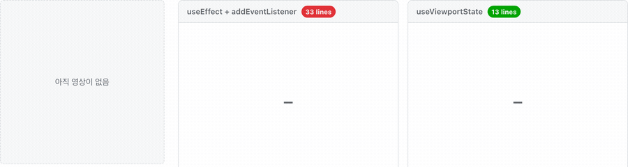

# react-cornerstone3d

[](https://www.npmjs.com/package/react-cornerstone3d)
[](./LICENSE)
[](./src)

**[라이브 데모](https://entrolec.github.io/react-cornerstone3d/)** · [English](./README.md)

[Cornerstone3D](https://www.cornerstonejs.org/)의 살아있는 뷰포트 상태를 React 컴포넌트에서 읽습니다 — `useSyncExternalStore` 기반, tearing 없음.

```bash
npm install react-cornerstone3d
```

```tsx
const slice = useViewportState('ct-axial', (s) => s.sliceIndex);
```

이 한 줄이 구독의 전부입니다. Provider도, 엔진 prop도, 이벤트 배선도, 정리 코드도 없습니다.



> 두 표시기는 **같은 위젯을 두 가지 방식으로 짠 것**이고, 같은 뷰포트를 읽습니다. UI가 영상보다
> 먼저 마운트됐기 때문에 `useEffect`로 직접 짠 쪽은 끝내 채워지지 않습니다 — 앞으로도 영영.
> [**직접 해보기 →**](https://entrolec.github.io/react-cornerstone3d/)

---

## 내 프로젝트에 맞을까?

| | |
|---|---|
| **읽는 것** | 카메라 · VOI 윈도우 · 슬라이스 인덱스 · 슬라이스 개수 |
| **뷰포트 종류** | Stack, Volume / MPR, 3D(슬라이스 없음으로 보고) |
| **어노테이션 · 툴 · 세그멘테이션** | **아직 없음** — [로드맵](#상태) |
| **엔진에 쓰기** | 제공하지 않음(의도적) — 쓰기는 계속 Cornerstone3D를 직접 호출 |
| **peer 의존성** | React 18 또는 19 · `@cornerstonejs/core` 5.x |
| **모듈 형식** | ESM 전용 |

v0.2가 하는 일은 딱 하나, **상태 동기화**입니다. 지금 화면에 어노테이션이나 세그멘테이션
상태가 필요하다면 이 라이브러리는 아직 그걸 못 합니다 — 이게 솔직한 답이고, 가장 먼저 아셔야
할 사실이라 맨 위에 둡니다.

---

## 시작하기

엔진은 계속 앱이 소유합니다. 라이브러리는 Cornerstone3D의 레지스트리를 통해 읽기만 합니다.

```tsx
import { useEffect } from 'react';
import {
  Enums,
  RenderingEngine,
  getEnabledElementByViewportId,
  init as coreInit,
  type Types,
} from '@cornerstonejs/core';
import { init as dicomImageLoaderInit } from '@cornerstonejs/dicom-image-loader';
import { CornerstoneViewport, useViewportState } from 'react-cornerstone3d';

const renderingEngineId = 'app-engine';

// 마운트 전에 한 번.
coreInit();
dicomImageLoaderInit();
new RenderingEngine(renderingEngineId);

function Viewer({ imageIds }: { imageIds: string[] }) {
  // 자식 effect가 부모보다 먼저 돌기 때문에, 여기 도달하면
  // <CornerstoneViewport>가 이미 뷰포트를 켜둔 상태입니다.
  useEffect(() => {
    const viewport = getEnabledElementByViewportId('ct-axial')
      ?.viewport as Types.IStackViewport | undefined;
    if (!viewport) return;

    viewport.setStack(imageIds).then(() => {
      viewport.resetCamera(); // 새 시리즈를 뷰포트에 맞춤
      viewport.render();
    });
  }, [imageIds]);

  return (
    <>
      <CornerstoneViewport
        viewportId="ct-axial"
        type={Enums.ViewportType.STACK}
        renderingEngineId={renderingEngineId}
        style={{ width: 512, height: 512 }}
      />
      <SliceIndicator />
    </>
  );
}

function SliceIndicator() {
  const slice = useViewportState('ct-axial', (s) => s.sliceIndex);
  const total = useViewportState('ct-axial', (s) => s.numberOfSlices);

  // 뷰포트 부재는 오류가 아니라 정상 상태입니다 — 무엇을 그릴지는 앱이 정합니다.
  if (slice === undefined) return null;
  return <span>{slice + 1} / {total}</span>;
}
```

스크롤, 윈도우/레벨, 슬라이더 — 전부 평범한 Cornerstone3D 호출 그대로입니다. 그 결과가 React에
닿는 경로는 엔진이 내보내는 이벤트이고, 이건 마우스 드래그가 지나가는 경로와 똑같습니다. 누가
상태를 바꿨든 읽기 경로는 하나입니다.

<details>
<summary><b>Vite 설정</b> — DICOM 로더 때문에 두 줄이 필요합니다</summary>

디코딩 워커가 `new Worker(new URL(…, import.meta.url))`로 만들어집니다. `.vite/deps`로
사전 번들되면 그 URL이 없는 파일을 가리키게 되고, **모든 이미지 디코딩이 조용히 실패합니다** —
메타데이터는 로드되는데 캔버스만 까맣습니다. 로더를 exclude하면 이번엔 그 CommonJS 코덱들이
사전 번들에서 빠지므로 다시 이름을 적어줘야 합니다:

```ts
export default defineConfig({
  optimizeDeps: {
    exclude: ['@cornerstonejs/dicom-image-loader'],
    include: [
      'dicom-parser',
      '@cornerstonejs/codec-charls/decodewasmjs',
      '@cornerstonejs/codec-libjpeg-turbo-8bit/decodewasmjs',
      '@cornerstonejs/codec-openjpeg/decodewasmjs',
      '@cornerstonejs/codec-openjph/wasmjs',
    ],
  },
  worker: { format: 'es' },
});
```

이건 이 라이브러리가 아니라 Cornerstone3D + Vite 조합의 문제입니다. 다만 찾는 데 반나절이
걸리므로 여기 적어둡니다.

</details>

---

## 이 훅이 대신하는 것

데모는 같은 위젯의 두 버전을 나란히 렌더링하면서 각각의 줄 수를 자기 소스에서 실시간으로
셉니다: **훅으로 13줄, 직접 짜면 33줄.** 그 33줄이 이겁니다.

<details>
<summary>직접 배선한 버전</summary>

```tsx
import { Enums, getEnabledElementByViewportId, type Types } from '@cornerstonejs/core';
import { useEffect, useState } from 'react';

export function SliceIndicatorByHand({ viewportId }: { viewportId: string }) {
  const [state, setState] = useState<{ slice: number; total: number }>();

  useEffect(() => {
    const enabled = getEnabledElementByViewportId(viewportId);
    if (!enabled) return; // no viewport yet? then never, even once it exists
    const viewport = enabled.viewport as Types.IStackViewport;
    const { element } = viewport;

    const update = () =>
      setState({ slice: viewport.getSliceIndex(), total: viewport.getNumberOfSlices() });
    update(); // patch the gap between first render and subscription — easy to forget

    element.addEventListener(Enums.Events.CAMERA_MODIFIED, update);
    element.addEventListener(Enums.Events.VOI_MODIFIED, update);
    element.addEventListener(Enums.Events.STACK_NEW_IMAGE, update);
    return () => {
      element.removeEventListener(Enums.Events.CAMERA_MODIFIED, update);
      element.removeEventListener(Enums.Events.VOI_MODIFIED, update);
      element.removeEventListener(Enums.Events.STACK_NEW_IMAGE, update);
    };
  }, [viewportId]);

  if (!state) return <span className="ind ind--empty">—</span>;
  return (
    <span className="ind">
      {state.slice + 1} / {state.total}
    </span>
  );
}
```

</details>

### 그리고 저 33줄을 다 쓰고도 버그는 남습니다

Cornerstone3D는 의도적으로 프레임워크 중립이라 React 바인딩을 제공하지 않습니다. 그래서 모든
뷰어가 이걸 직접 짜고, 같은 결함을 함께 물려받습니다. **실제로 얼마나 자주 터지는지** 순으로:

**매번**

- **마운트 순서 경쟁.** 위젯보다 *나중에* 켜진 뷰포트는 영영 구독되지 않습니다. effect는 한 번
  확인하고 아무것도 못 찾았고, 다시 돌 이유가 없습니다.
  ([데모에서 재현](https://entrolec.github.io/react-cornerstone3d/))
- **유령 상태.** 뷰포트가 파괴돼도 위젯은 마지막으로 본 숫자를 계속 보여줍니다 — 이미 존재하지
  않는 영상의 번호를, 죽은 요소에 걸린 리스너와 함께.
- **엔진 이벤트마다 React 렌더 한 번.** 드래그는 프레임보다 훨씬 빠르게 이벤트를 쏟아내는데,
  이를 묶어주는 게 아무것도 없습니다.

**개발 중에**

- StrictMode의 의도적 이중 마운트에서 **구독이 두 번** 걸립니다.

**조건이 맞을 때**

- concurrent 렌더링에서의 **tearing**: 한 화면의 두 컴포넌트가 서로 다른 슬라이스 번호를
  보여줍니다.
- **무한 루프, 또는 그걸 피하려는 deep-compare 꼼수.** Cornerstone3D 게터는 호출할 때마다 새
  객체를 돌려주므로 순진한 `getSnapshot`은 절대 안정화되지 않습니다. 직접 짠 바인딩은 결국
  이벤트마다 깊은 비교나 `JSON.stringify` 비교를 하게 됩니다.

이 라이브러리는 그 층을 중앙에서 한 번만 해결합니다. 덕분에 UI 컴포넌트는 엔진 상태의 순수
함수로 남습니다.

---

## 어떻게 동작하나

모든 걸 결정하는 세 가지 선택입니다. 전체 근거는 [`docs/adr/`](./docs/adr/)에 있습니다.

**1 · 엔진이 유일한 진실이다.**
읽기는 엔진 → 이벤트 → 불변 Snapshot → `useSyncExternalStore`로 흐릅니다. 쓰기는 평범한
Cornerstone3D 호출 그대로입니다. 별도 쓰기 API도, 에코 억제도 없고, 누가 상태를 움직였든 읽기
경로는 하나입니다.

**2 · 라이브러리는 엔진을 소유하지 않는다.**
훅은 `viewportId`만 받아 Cornerstone3D의 전역 레지스트리로 찾습니다. Provider도, 싱글턴도,
엔진 prop도 없습니다 — 기존 엔진 관리 방식을 그대로 두세요.

**3 · 부재는 정상 상태다.**
아직 켜지지 않은 뷰포트는 `undefined`를 돌려줍니다. 뷰포트가 생기면 알아서 채워지고, 파괴되면
알아서 비워집니다. 그동안 무엇을 그릴지는 앱이 정합니다.

그 위에서 모든 Snapshot은 **참조가 안정적**이고(상태가 안 변했으면 동일 참조 — 헛렌더도,
루프도 없음) **깊게 동결**됩니다(받은 값이 밑에서 바뀌지 않음).

---

## API

### `useViewportState(viewportId, selector?, options?)`

```ts
function useViewportState(
  viewportId: string,
  selector?: undefined,
  options?: UseViewportStateOptions,
): ViewportState | undefined;

function useViewportState<T>(
  viewportId: string,
  selector: (state: ViewportState) => T,
  options?: UseViewportStateOptions,
): T | undefined;
```

| 인자 | 동작 |
|---|---|
| `viewportId` | Cornerstone3D 전역 레지스트리로 찾습니다. 해당 id의 뷰포트가 없으면 `undefined`. |
| `selector` | 고른 값이 `Object.is` 기준으로 바뀔 때만 리렌더합니다. 뷰포트가 없을 땐 호출되지 않습니다. |
| `options.batch` | 기본 `true`: 엔진 이벤트를 프레임당 최대 한 번으로 묶습니다. `false`면 이벤트 단위 그대로. |

```ts
interface ViewportStateCommon {
  camera: Types.ICamera;
  voiRange: Types.VOIRange | undefined;
  sliceIndex: number | undefined;
  numberOfSlices: number | undefined;
}
interface StackViewportState extends ViewportStateCommon {
  kind: 'stack';
  sliceIndex: number;
  numberOfSlices: number;
}
interface VolumeViewportState extends ViewportStateCommon {
  kind: 'volume';
}
type ViewportState = StackViewportState | VolumeViewportState;
```

`sliceIndex`와 `numberOfSlices`는 모든 종류에 공통이라 **슬라이더 하나가 Stack과 MPR 화면을
동시에 커버합니다.** 나머지는 `kind`로 좁혀서 쓰세요.

Stack에서 `sliceIndex`는 *요청된* 슬라이스입니다 — 이미지 로딩이 끝날 때가 아니라 스크롤하는
즉시 움직입니다
([ADR 0003](./docs/adr/0003-image-id-index-is-the-requested-slice.md)).
Volume에서는 카메라에서 유도되므로 픽셀보다 앞서 나가지 않습니다. 슬라이스가 없는 뷰포트(3D,
또는 `setVolumes` 이전의 Volume)는 두 값 모두 `undefined`를 보고합니다.

### `<CornerstoneViewport />`

선택 사항입니다. `<div>`를 렌더링하고, 마운트 시 뷰포트로 켜고, 언마운트 시 끕니다. 엔진은
여전히 앱이 만들고, 컴포넌트는 레지스트리로 찾기만 합니다.

```tsx
<CornerstoneViewport
  viewportId="ct-axial"
  type={Enums.ViewportType.STACK}
  style={{ width: 512, height: 512 }}
/>
```

| Prop | 설명 |
|---|---|
| `viewportId` | 켤 id — `useViewportState`가 관찰하는 그 id. |
| `type` | `Enums.ViewportType`, `enableElement`로 전달됩니다. |
| `defaultOptions?` | `Types.ViewportInputOptions`, 켤 때 한 번만 적용됩니다. 이후 변경은 재생성하지 않습니다. |
| `renderingEngineId?` | 켤 대상 엔진. 등록된 엔진이 하나면 그걸 씁니다. 0개거나 여러 개인데 id가 없으면 throw. |
| `...divProps` | 나머지는 전부 `<div>`로 갑니다. |

마운트 시점에 엔진이 없는 건 마운트 순서 버그이므로, 이 컴포넌트는 적당히 넘어가지 않고
throw합니다 — 뷰포트 부재가 정상 상태인 훅과는 다릅니다.

---

## 상태

| 기능 | |
|---|---|
| Stack 뷰포트 상태(카메라, VOI, 슬라이스 인덱스) | ✅ |
| Volume 뷰포트 상태 + 종류별 타입 | ✅ |
| Slice Position(`sliceIndex`, `numberOfSlices`) 양쪽 공통 | ✅ |
| 뷰포트 부재 계약(`undefined`) | ✅ |
| 뷰포트당 공유 Binding, StrictMode 안전 | ✅ |
| 뷰포트 생성·파괴 시 자동 채움·비움 | ✅ |
| Selector(내가 고른 값이 바뀔 때만 리렌더) | ✅ |
| 상호작용 이벤트 rAF 배칭 | ✅ |
| 선택적 `<CornerstoneViewport />` | ✅ |
| 어노테이션 / 툴 / 세그멘테이션 상태 | 로드맵 |

**범위 밖:** 앱 상태 관리(Zustand든 뭐든 원하는 걸 쓰세요), 쓰기 헬퍼, 선택적 컴포넌트를 넘는
엔진·뷰포트 생명주기, 렌더링 성능 — 마지막 건 엔진의 일입니다.

---

## 개발

```bash
npx playwright install chromium   # 한 번 — 브라우저 테스트가 실제 Cornerstone3D를 구동합니다
npm test                          # 유닛(jsdom + 가짜 CS3D 레지스트리)과 브라우저 프로젝트
npm run build                     # tsc → dist/
npm run demo                      # 데모 사이트 로컬 실행
```

유닛 테스트는 공개 훅 API만 관찰합니다 — 반환값, 참조 안정성, 리렌더 횟수. 브라우저 테스트는
실제 엔진을 돌려 가짜가 세운 가정을 검증합니다. 도메인 어휘(Engine, Viewport State, Snapshot,
Command, Binding)는 [`CONTEXT.md`](./CONTEXT.md)에 있습니다.

## 라이선스

MIT
